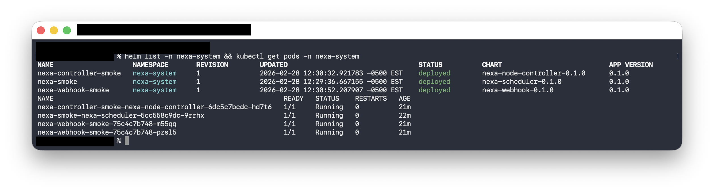
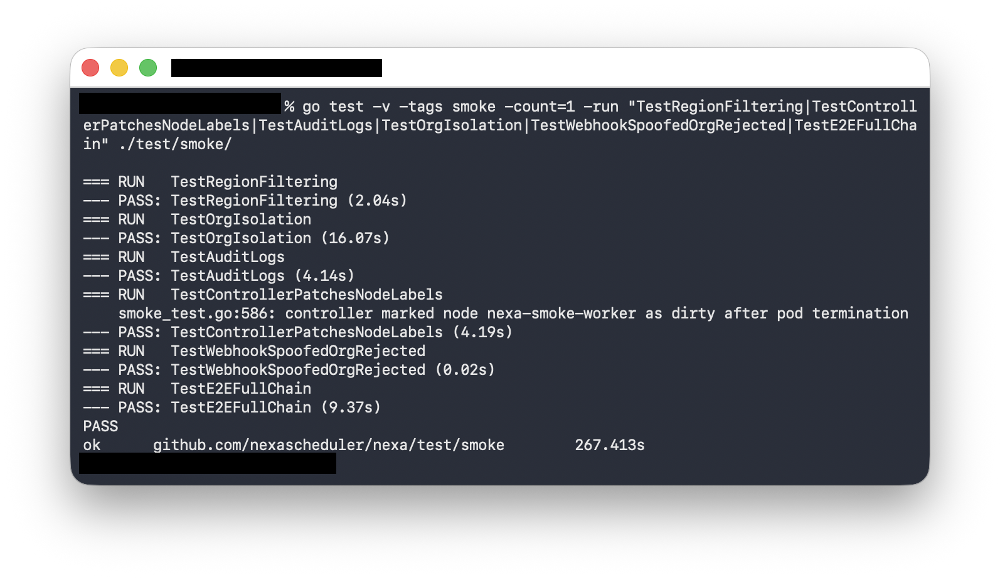
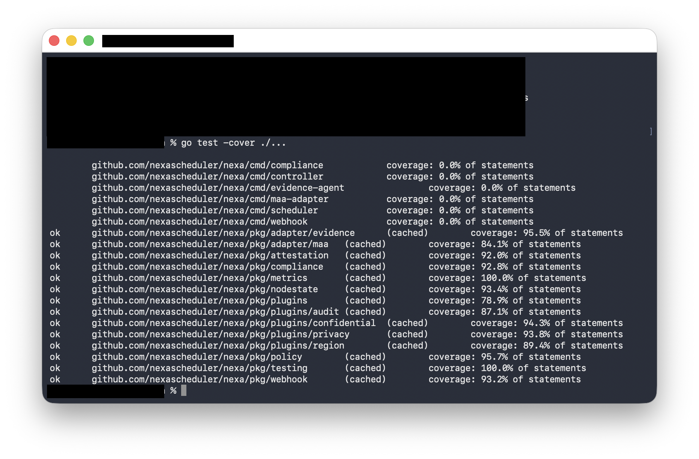
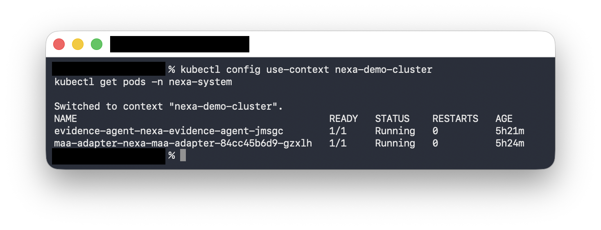
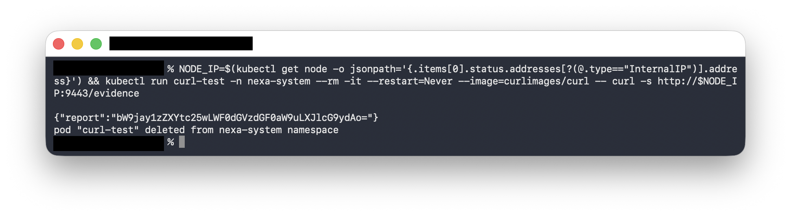
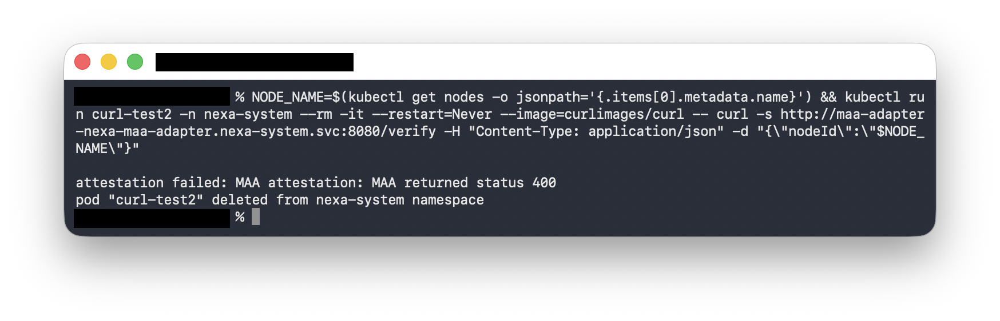
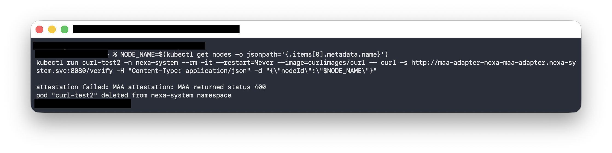

# Nexa Works: The Evidence

Nexa is a Kubernetes scheduler that enforces privacy, regional compliance, and confidential compute constraints on shared clusters. This page presents terminal-level proof that every claim is backed by working code running on real infrastructure.

## 1. The scheduler runs in a real Kubernetes cluster

Three Helm releases deployed to a Kind cluster: the scheduler itself, a node state controller, and an admission webhook. All four pods are Running 1/1 with zero restarts.

This matters because Nexa is an out-of-tree scheduler plugin — it has to integrate with the Kubernetes scheduler framework, register its plugins correctly, and start serving. If any component fails to initialize, the pod crashes. These are all healthy.



## 2. Six smoke tests pass on a live cluster

A Kind cluster with three worker nodes runs the full smoke test suite: region-based pod rejection, org isolation with node sanitization, structured audit logging, node label patching on pod termination, webhook-based label spoofing prevention, and an end-to-end chain exercising all constraint types simultaneously.

These are not unit tests with mocked interfaces. Each test creates real pods, submits them to the real scheduler, and observes real scheduling decisions. `TestOrgIsolation` takes 16 seconds because it runs the full lifecycle: pod finishes, controller marks node dirty, second pod from a different org is rejected, node is sanitized, second pod is rescheduled.



## 3. 14 packages, strong test coverage

Every package compiles and passes its unit tests. Coverage ranges from 78.9% (plugins) to 100% (metrics, testing). The security-critical packages are well-tested: privacy at 93.8%, webhook at 93.2%, policy at 95.7%, confidential compute at 94.3%.

The `cmd/` packages show 0% because they contain only `main()` functions with flag parsing and signal handling — code that is tested through the smoke tests instead.



## 4. Azure confidential compute attestation — the full pipeline

The remaining screenshots prove that Nexa's attestation pipeline works end-to-end on a real Azure Kubernetes Service cluster with confidential compute nodes.

### Both attestation pods running on AKS

The evidence agent (DaemonSet) and MAA adapter (Deployment) are both Running 1/1 on the `nexa-demo-cluster`. The evidence agent has been up for 5h21m with zero restarts — it's stable.



### Evidence agent collects hardware attestation reports

A curl request to the evidence agent's HTTP endpoint on port 9443 returns a base64-encoded attestation report. In production, this would be a real SEV-SNP hardware measurement from `/dev/sev-guest`. The agent reads the device, encodes it, and serves it over HTTP so the adapter can fetch it.



### MAA adapter forwards evidence to Azure Attestation

The adapter receives a `POST /verify` request with a node ID, looks up the node's internal IP via the Kubernetes API, fetches the evidence from the agent running on that node, and forwards it to Azure MAA's `/attest/SevSnpVm` endpoint.

Azure MAA returns HTTP 400 — and that's the correct result. The 400 proves the entire pipeline is wired correctly: the adapter successfully resolved the node, fetched the evidence, and sent it to Microsoft's real attestation service. MAA rejected it because the report is mock data, not a genuine hardware measurement. On a real SEV-SNP VM, this would return a signed JWT with attestation claims.



The earlier screenshot from the same session shows the same result from a slightly different angle — the error message `attestation failed: MAA attestation: MAA returned status 400` confirms fail-closed behavior. If attestation fails for any reason, the node is marked unattested.



## 5. Structured audit log output — the receipt

Every scheduling decision produces a JSON line to stderr. The schema is defined in `pkg/plugins/audit/logger.go` and tested in `pkg/plugins/audit/audit_test.go`.

**Successful placement (emitted at PostBind):**

```json
{
  "timestamp": "2026-02-27T12:00:00Z",
  "level": "INFO",
  "event": "scheduled",
  "pod": {
    "name": "secure-job",
    "namespace": "default",
    "privacy": "high",
    "region": "us-west1",
    "zone": "us-west1-a",
    "org": "acme"
  },
  "node": "node-1",
  "policy": {
    "regionEnabled": true,
    "privacyEnabled": true
  }
}
```

**Failed placement with per-node rejection reasons (emitted at PostFilter):**

```json
{
  "timestamp": "2026-02-27T12:00:00Z",
  "level": "INFO",
  "event": "scheduling_failed",
  "pod": {
    "name": "multi-fail",
    "namespace": "",
    "region": "eu-west1"
  },
  "policy": {
    "regionEnabled": true,
    "privacyEnabled": true
  },
  "filters": [
    {"node": "node-a", "reason": "region mismatch"},
    {"node": "node-b", "reason": "region mismatch"},
    {"node": "node-c", "reason": "node tainted"}
  ]
}
```

Every entry records which pod, which node (or why none), which policies were active, and per-node rejection reasons. Sensitive data (env vars, secrets, service account tokens) is explicitly excluded — `TestPostBindNoSensitiveData` creates a pod with secrets and verifies they never appear in the log output.

Parseable by Fluentd/Fluent Bit/Loki. Grafana query examples from `docs/integration.md`:

```
{container="nexa-scheduler"} | json | event="scheduling_failed"
{container="nexa-scheduler"} | json | pod_privacy="high"
```

## 6. Privacy isolation — the full lifecycle

The privacy plugin (`pkg/plugins/privacy/`) and node state controller (`pkg/nodestate/`) work together to enforce a sanitization cycle. Here is the step-by-step sequence:

**Step 1 — Pod A finishes on a wiped node.** `worker-0` starts with `nexa.io/wiped=true` and `nexa.io/wipe-on-complete=true`. Pod A (`org=alpha`) runs and completes.

**Step 2 — Controller marks node dirty.** The node state controller detects the pod termination event (`controller.go:168-174`). Because `wipe-on-complete=true`, it patches the node: sets `nexa.io/wiped=false`, clears `nexa.io/wipe-timestamp`, and sets `nexa.io/last-workload-org=alpha`.

**Step 3 — Pod B (different org) is rejected.** Pod B (`org=beta`, `privacy=high`) enters scheduling. The privacy filter (`privacy.go:106`) checks `nexa.io/wiped` — it's `false`. Rejection reason: `"run node wipe procedure before scheduling high-privacy workloads"`. The audit log records `event: "scheduling_failed"` with the rejection.

**Step 4 — Node is sanitized.** An operator (human or automation) runs the wipe procedure and labels the node: `nexa.io/wiped=true`, `nexa.io/wipe-timestamp=<now>`.

**Step 5 — Pod B lands.** The privacy filter passes: `wiped=true`, timestamp is fresh, org check passes. Pod B schedules. The audit log records `event: "scheduled"`.

This cycle is tested end-to-end in `test/smoke/smoke_test.go:507-587` (`TestControllerPatchesNodeLabels`) on a real Kind cluster with three labeled workers. The test takes ~16 seconds because it runs the full lifecycle including controller reconciliation.

Node labels involved:

| Label | Purpose |
|-------|---------|
| `nexa.io/wiped` | `true`/`false` — controls whether high-privacy pods can land |
| `nexa.io/wipe-on-complete` | `true` — auto-marks node dirty when a pod terminates |
| `nexa.io/wipe-timestamp` | RFC3339 — enables cooldown policy ("only nodes wiped within N hours") |
| `nexa.io/last-workload-org` | Org of last terminated pod — prevents cross-org contamination |

## 7. Compliance report — HIPAA/SOC 2/GDPR artifacts

The `nexa-report` CLI (`cmd/compliance/main.go`) reads audit log JSON lines offline and produces compliance artifacts. Implemented in Sprint 14 with 92.8% test coverage.

```bash
nexa-report --input /var/log/nexa/audit.jsonl \
  --standard hipaa --org alpha \
  --from 2026-01-01T00:00:00Z --to 2026-02-01T00:00:00Z \
  --format json
```

**JSON output:**

```json
{
  "generatedAt": "2026-02-28T12:00:00Z",
  "standard": "HIPAA",
  "orgs": [
    {
      "org": "alpha",
      "standard": "HIPAA",
      "from": "2026-01-01T00:00:00Z",
      "to": "2026-02-01T00:00:00Z",
      "totalDecisions": 100,
      "compliant": 98,
      "violations": [
        {
          "timestamp": "2026-01-15T10:00:00Z",
          "pod": "pod1",
          "namespace": "ns1",
          "node": "n1",
          "reason": "missing privacy label (required by HIPAA)"
        }
      ],
      "scheduledCount": 95,
      "failedCount": 5
    }
  ],
  "parseWarnings": 0
}
```

**Markdown output** (`--format markdown`):

```markdown
# Compliance Report: HIPAA

| Metric | Count |
|--------|-------|
| Total decisions | 100 |
| Compliant | 98 |
| Violations | 2 |
| Scheduled | 95 |
| Failed | 5 |

### Violations

| Timestamp | Pod | Namespace | Node | Reason |
|-----------|-----|-----------|------|--------|
| 2026-01-15T10:00:00Z | pod1 | ns1 | n1 | missing privacy label (required by HIPAA) |
```

Each standard checks different requirements:

| Standard | Privacy label required | Region label required | Violation condition |
|----------|---|---|---|
| **HIPAA** | Yes | Yes | Missing privacy/region labels, or policies disabled |
| **SOC 2** | No | No | Both privacy and region policies disabled |
| **GDPR** | No | Yes | Missing region label, or region policy disabled |

The tool is offline (zero runtime coupling to the scheduler), supports per-org and time-range filtering, and reports both compliant decisions and violations so auditors have proof of compliance, not just a list of failures.

## What this proves

| Claim | Evidence | Source |
|-------|----------|--------|
| Scheduler runs as a real K8s plugin | 3 Helm releases, 4 pods Running | Kind cluster |
| Pods are rejected based on region constraints | TestRegionFiltering PASS | Smoke tests |
| Org isolation with node sanitization works | TestOrgIsolation PASS (16s lifecycle) | Smoke tests |
| Structured audit logs are emitted | TestAuditLogs PASS | Smoke tests |
| Audit log JSON contains nodes, rejections, policies | DecisionEntry schema + TestPostBind/TestPostFilter | `pkg/plugins/audit/` |
| Privacy isolation lifecycle works end-to-end | TestControllerPatchesNodeLabels (16s full cycle) | Smoke tests |
| Compliance reports for HIPAA/SOC 2/GDPR | `nexa-report` CLI, 92.8% coverage | `pkg/compliance/` |
| Controller patches node labels on pod events | TestControllerPatchesNodeLabels PASS | Smoke tests |
| Webhook prevents label spoofing | TestWebhookSpoofedOrgRejected PASS | Smoke tests |
| Full evidence chain works end-to-end | TestE2EFullChain PASS | Smoke tests |
| Test coverage is strong across all packages | 14 packages, 78.9%–100% | Local |
| Attestation pipeline reaches Azure MAA | 400 from real Azure endpoint | AKS cluster |
